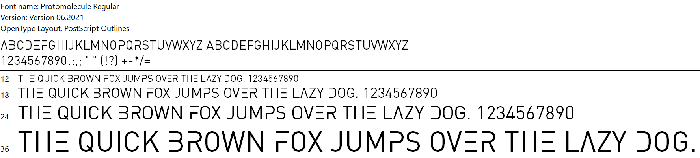

# TEXP-Magic-Pack

Pack containing normal M15 frames for MSE, along with a custom font for The Expanse.

## Installation

1. Download and extract [this zip file](https://github.com/sboosali/TEXP-Magic-Pack/archive/refs/heads/main.zip).
2. Extract the zip file. It will contain 5 items:
    * a folder `data`, which is where the templates are installed.
    * a folder `Magic - Fonts`, which contains necessary font files.
    * `magicseteditor.exe` and `mse.exe`, the regular version of the app.
    * `magicseteditor - 201`, the previous stable version of the app.
    * `magicseteditor.com`, a command-line version of MSE for advanced users.
4. Inside the extracted folder, open the subfolder `Magic - Fonts`. It contains several `.ttf` and/or `.otf` files. Select them all, right-click on one of them, then click Install.
5. Move or copy all other subfolders into your MSE folder.

## Font

### Protomolecule

selon `@ThinkDualBrain`:

>This is a font based on the text seen in [The Expanse](https://en.wikipedia.org/wiki/The_Expanse_%28TV_series%29) for things like credits and captions. Big thanks goes to [/u/xeow](https://www.reddit.com/u/xeow) on Reddit who originally [identified](https://old.reddit.com/r/TheExpanse/comments/61mipk/the_expanse_alphabet/) [DIN Pro](https://www.cufonfonts.com/font/dinpro) as the base font.

If you see any mistakes or problems, let me know and I'm happy to correct them.

Many have asked permission to use this font for your personal or commercial projects. So let me make 2 points clear:

1) I (personally) have no problem with anybody using the font for whatever they like. Big or small, commercial or hobby. I created and released this font for that exact purpose. But....

2) I am NOT the trademark holder or licensee for The Expanse nor it's artwork. This is a fan-made font, and I likely have no legal grounds for ownership of it. Additionally, both this font and the one used in the show are a modified version of the DIN Pro font, which I ALSO do not own a license for, nor can I grant usage rights to. So in both possible cases, I am not in a position to grant ANY legal protections. USE IT AT YOUR OWN RISK!

All that said, Enjoy!